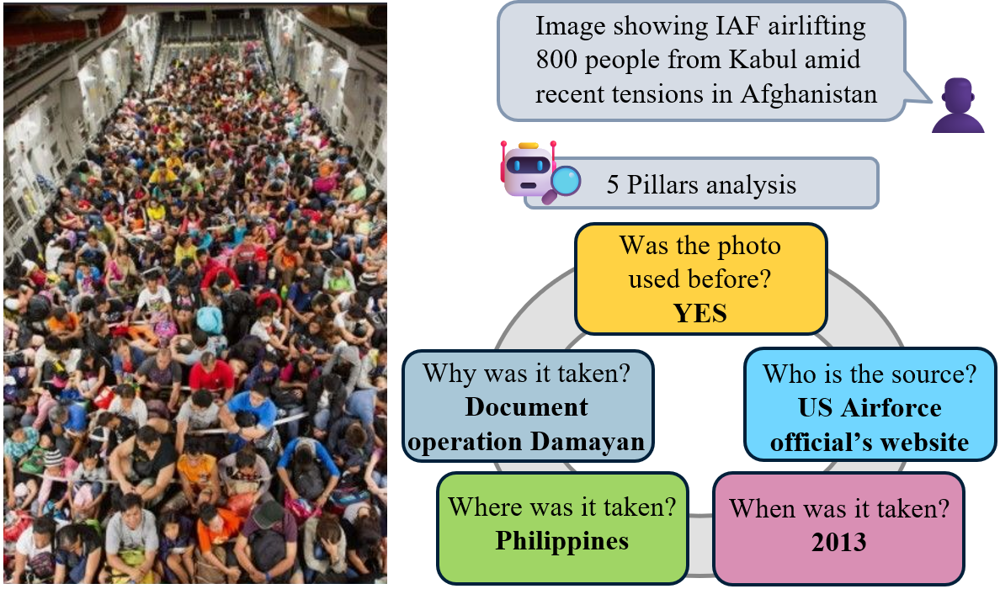
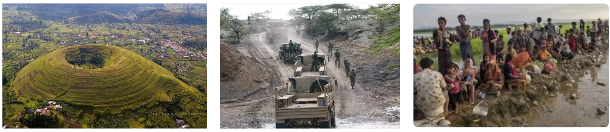

# Image, Tell me your story! Predicting the original meta-context of visual misinformation

[](https://opensource.org/licenses/Apache-2.0)
[](https://www.python.org/)

This repository contains the 5Pils dataset, introduced in the EMNLP 2024 paper: ["Image, Tell me your story!" Predicting the original meta-context of visual misinformation](https://aclanthology.org/2024.emnlp-main.448/). The code is released under an **Apache 2.0** license, while the dataset is released under a **CC-BY-SA-4.0** license.

Contact person: [Jonathan Tonglet](mailto:jonathan.tonglet@tu-darmstadt.de) 

[UKP Lab](https://www.ukp.tu-darmstadt.de/) | [TU Darmstadt](https://www.tu-darmstadt.de/)

The dataset is also available on [TUdatalib](https://tudatalib.ulb.tu-darmstadt.de/handle/tudatalib/4317).

Don't hesitate to send us an e-mail or report an issue, if something is broken (and it shouldn't be) or if you have further questions. 

## News 📢

- Iryna Gurevych presented 5Pils during the opening keynote of [ECAI](https://www.ecai2024.eu/programme/keynotes) 2024
- Our paper is accepted to EMNLP 2024 Main Conference! See you in Miami 🏖️

## Abstract 
> To assist human fact-checkers, researchers have developed automated approaches for visual misinformation detection. These methods assign veracity scores by identifying inconsistencies between the image and its caption, or by detecting forgeries in the image. However, they neglect a crucial point of the human fact-checking process: identifying the original metacontext of the image. By explaining what is *actually true* about the image, fact-checkers can better detect misinformation, focus their efforts on check-worthy visual content, engage in counter-messaging before misinformation spreads widely, and make their explanation more convincing. Here, we fill this gap by introducing the task of automated image contextualization. We create 5Pils, a dataset of 1,676 fact-checked images with question-answer pairs about their original meta-context. Annotations are based on the 5 Pillars fact-checking framework. We implement a first baseline that grounds the image in its original meta-context using the content of the image and textual evidence retrieved from the open web. Our experiments show promising results while highlighting several open challenges in retrieval and reasoning.

<p align="center">
  
</p>


## 5Pils dataset

The 5Pils dataset consists of 1,676 fact-checked images annotated with question-answer pairs based on the 5 Pillars framework. The annotations are contained in the train.json, val.json, and test.json files of the dataset folder. 
For downloading the images, please refer to the section **Usage - downloading images** or contact jonathan.tonglet@tu-darmstadt.de if you face issues.
More information about the dataset can be found in the [README](https://github.com/UKPLab/5pils/tree/main/dataset) of the dataset folder.


<p align="center">
  
</p>


### ❕**Content warning** ❕
> 5Pils contains examples of real-world misinformation.  Due to the real-world nature of the data, events covered include wars and conflicts. As a result, some images contain graphic, violent content. When collecting the data, we decided not to filter out images with violent content to cover the actual distribution of images that our target users, professional fact-checkers, would want to provide as input. Given
the graphic nature of some images, we do not release them directly. Instead, we do publicly release the URLs of the FC articles and the images.

### 5Pils example

````json
    {
        "URL": "https://factly.in/2013-evacuation-image-from-typhoon-hit-philippines-is-passed-off-as-iaf-airlifting-800-people-from-kabul",
        "image path": "dataset/processed_img/2013-evacuation-image-from-typhoon-hit-philippines-is-passed-off-as-iaf-airlifting-800-people-from-kabul.png",
        "org": "factly",
        "publication date": "2021-08-17T12:00:55+00:00",
        "claim": "The image shows 800 people airlifted by the Indian Air Force from Kabul.",
        "was the photo used before?": "yes",
        "source": "US Airforce's official website",
        "date": "2013",
        "date numeric label": "['2013-01-14T00:00:00+00:00']",
        "location": "Tacloban city, Philippines",
        "motivation": "To document the US Airforce\u2019s operation Damayan evacuation in 2013",
        "type of image": "out-of-context",
        "verification strategy": "['reverse image search']",
        "verification tool": "['Other/Unspecified']",
        "claimed location": "Kabul, Afghanistan",
        "claimed date": "2021",
        "image URL": "https://factly.in/wp-content/uploads//2021/08/IAF-Airlift-Afghanistan-FB-Post.jpg"
    }

````

## Environment

Follow these instructions to recreate the environment used for all our experiments.

```
$ conda create --name 5Pils python=3.9
$ conda activate 5Pils
$ pip install -r requirements.txt
$ python -m spacy download en_core_web_lg
```


## Usage - downloading images

To use the dataset, you need to collect the images using the following script. If you face issues downloading the images, please contact jonathan.tonglet@tu-darmstadt.de

```
$ python scripts/build_dataset_from_url.py
```

## Usage - evaluation

Evaluate the performance of a model on 5Pils for a specific pillar. In this example, we evaluate Date.
The results need to be contained in a list of dictionaries, where each dictionary contains an 'output' and a 'ground_truth' kzy. 'output' should be a string.

```
$ python scripts/evaluate_answer_generation.py --results_file output/results_date.json --task date
```
 
Evaluation of Location requires 🌍 [GeoNames](https://www.geonames.org/). You will need to create a (free) account and provide your account name as input.

## Usage - baseline 

<p align="center">
  
</p>

### Collecting the evidence

Collect the text evidence based on their URLS:

```
$ python scripts/collect_RIS_evidence.py --collect_google 0 --evidence_urls dataset/retrieval_results/evidence_urls.json 
```

Instead of using our evidence set, you can also collect your own by setting *collect_google* to 1. This will require to provide a Google Vision API key. 


### Predict and collect the original of manipulated images

Step 1 (Optional): Classify images as manipulated or not after fine-tuning a ViT model on the train set. This step is optional as the predictions for the test set are already provided in *dataset/manipulation_detection_test.json*

```
$ python scripts/get_manipulated_images.py
```

Step 2: Replace manipulated images by the earliest corresponding reverse image search result:

```
$ python scripts/get_originals_of_manipulated.py --download_image 1
```

###  Compute embeddings 

Compute embeddings for evidence ranking and few-shot demonstration selection:

```
$ python scripts/get_embeddings.py
```

### Generate answers

Generate answers for a specific pillar. In this example, we generate answers for Date with multimodal zero-shot Llava:

```
$ python scripts/get_5pillars_answers.py --results_file output/results_date.json --task date --modality multimodal --n_shots 0 --model llava
```

### Google Vision API and Azure OpenAI service

- Our baseline model relies on evidence retrieved with reverse image search using the [Google Vision API](https://cloud.google.com/vision/docs/detecting-web). Should you want to collect your own evidence, you will need a Google Cloud account.

- If you want to use GPT4(-Vision) for answer generation, you will need an Azure account with access to the [Azure OpenAI service](https://learn.microsoft.com/en-us/azure/ai-services/openai/overview).

## Citation

If you use the 5Pils dataset or this code in your work, please cite our paper as follows:

```bibtex 
@inproceedings{tonglet-etal-2024-image,
    title = "{``}Image, Tell me your story!{''} Predicting the original meta-context of visual misinformation",
    author = "Tonglet, Jonathan  and
      Moens, Marie-Francine  and
      Gurevych, Iryna",
    editor = "Al-Onaizan, Yaser  and
      Bansal, Mohit  and
      Chen, Yun-Nung",
    booktitle = "Proceedings of the 2024 Conference on Empirical Methods in Natural Language Processing",
    month = nov,
    year = "2024",
    address = "Miami, Florida, USA",
    publisher = "Association for Computational Linguistics",
    url = "https://aclanthology.org/2024.emnlp-main.448",
    pages = "7845--7864",
}
```

## Disclaimer

> This repository contains experimental software and is published for the sole purpose of giving additional background details on the respective publication.


